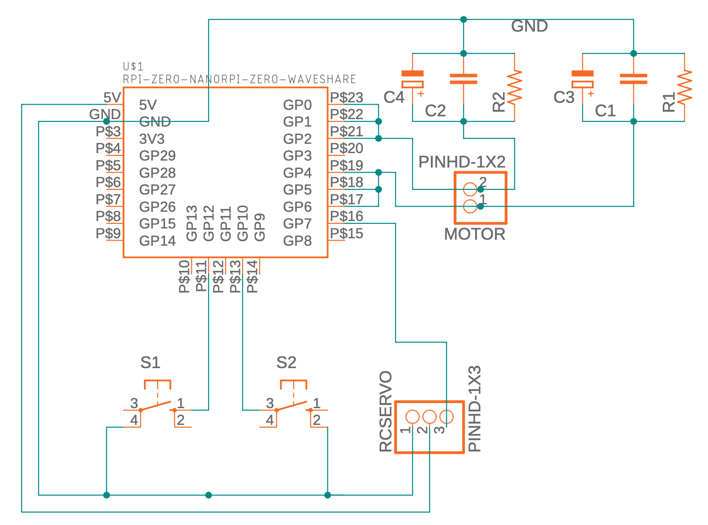

# mini_shutter

Mini optical shutter using 4mm coreless DC motor and RP2040 driver using CircuitPython.  Allows a computer to control an optical shutter via a USB-C connection.

Uses a Waveshare <a
href="https://www.waveshare.com/rp2040-zero.htm">RP2040-Zero board</a>
and <a
href="https://learn.adafruit.com/welcome-to-circuitpython/what-is-circuitpython">Adafruit's
CircuitPython</a>.

# Setup

Mini-shutter driver schematic:

Note that the resistors and capacitors are optional, and the header for an optional RC servo is not used.

# Loading code

1. Copy adafruit-circuitpython-raspberry_pi_pico-en_US-7.2.5.uf2 to the boot RPI-RP2 drive
2. Wait for RP2040 to re-mount itself as CIRCUITPY
3. Copy my-circuitpy-lib/* to CIRCUITPY/lib/
4. Copy mini_shutter2.py to CIRCUITPY/code.py

